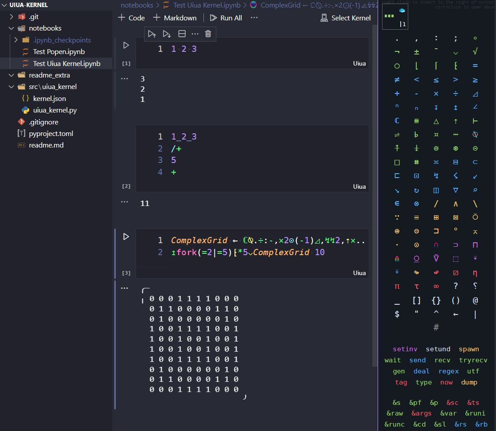

# Uiua Kernel <!-- omit in toc -->

IPython Kernel for the [Uiua](https://www.uiua.org/) programming language,
crudely implemented as a python wrapper.

> This is an experimental repo, and not currently part of the official Uiua project.

- [1. Usage / Development instructions](#1-usage--development-instructions)
- [2. Implementation Notes](#2-implementation-notes)
  - [2.1. Formatting](#21-formatting)
  - [2.2. Color Of Output](#22-color-of-output)
  - [2.3. Large Output; Sounds and Images](#23-large-output-sounds-and-images)
  - [2.4. `uiua repl` vs `uiua eval`](#24-uiua-repl-vs-uiua-eval)
- [3. Future Direction](#3-future-direction)
- [4. See Also](#4-see-also)



## 1. Usage / Development instructions

This repo is not ready for general use, although it does work, so only
development instructions are provided; It requires that
[Rust and Cargo and Uiua have already been installed](https://www.uiua.org/install)

```bash
git clone # ... url for this repo
cd # ... path to this repo
pip install -e .
jupyter kernelspec install ".\src\uiua_kernel" --user --log-level DEBUG 
```

## 2. Implementation Notes

### 2.1. Formatting

A Jupyter Kernel apparently cannot offer to format cell contents. This is still
a language server feature, and it is not clear if it can be triggered on cell
execution, like [Uiua pad](https://www.uiua.org/pad)

### 2.2. Color Of Output

I messed around with the python package `ansi2html` but I'm pretty sure the colour codes just aren't in the output. Maybe they are there but they are getting lost somehow in the mysterious machinery of `subprocess.Popen`.

I think `uiua eval` detects if it is running in an interactive terminal, and if not, it
does not appear to output ansi colour codes. The `eval` command offers a
`--no-color` flag, but maybe it should also offer a `--always-color` flag or something.

### 2.3. Large Output; Sounds and Images

Currently this seems impossible; `uiua eval` can only output a formatted text
stream.

The jupyter kernel apparently requires image data in a base64 encoded format.
Perhaps uiua could output a JSON-formatted output to facilitate appropriate
output rendering.

### 2.4. `uiua repl` vs `uiua eval`

I did not try to connect this kernel wrapper to `uiua repl`.
The repl also does not maintain the state of the stack between calls, so I am not sure if there is any reason to try?

## 3. Future Direction

It seems to me like the best way forward is to implement the kernel directly in
rust, this would be much easier than maintaining this python wrapper. The
[`zmq`](https://crates.io/crates/zmq) crate and the
[jupyter docs](https://jupyter-protocol.readthedocs.io/en/latest/) are a good
place to start, also a good example to work from might be the
[evcxr](https://github.com/evcxr/evcxr) is basically a jupyter kernel for the
rust programming language itself (Insane, I know, but its very cool).


## 4. See Also

- Uiua <https://github.com/uiua-lang/uiua>
- Uiua Keypad <https://github.com/thehappycheese/uiua-keypad>
- Uiua Talon <https://github.com/thehappycheese/uiua-talon>